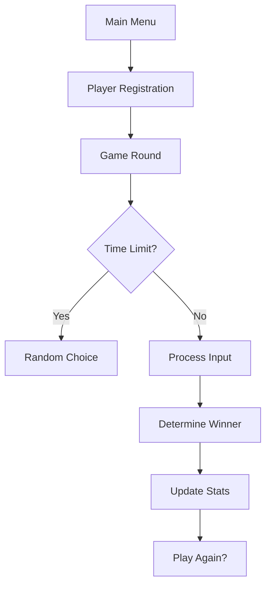

# Rock-Paper-Scissors Game (Jokempo) 🎮✊✋✌

## Group
- Gabriel Diegues - RM550788
- Luiza Cristina - RM99367
- Pedro Palladino - RM551180
- Renato Izumi - RM99242

## Overview
A Portuguese/Brazilian console-based Rock-Paper-Scissors game with:
- **Two-choice gameplay** (players select 2 options per round)
- **Smart AI opponent** using minimax algorithm
- **Player statistics tracking**
- **Time-limited inputs** for added challenge
- **Thread-safe random generation**

## How to Play
1. Run the program (requires .NET 6+)
2. Enter your name when prompted
3. Each round:
   - Choose **two moves** (Rock=0, Paper=1, Scissors=2)
   - The computer responds with its own strategy
   - Results are shown immediately
4. Game continues until you choose to exit

## Special Features
### 🧠 AI Behavior
- Uses **minimax algorithm** to predict player moves

### ⏱ Time Pressure
- Initial **6-second** decision window
- Gradually decreases to **2-second** minimum
- Missed inputs trigger random selection

### 📊 Statistics System
- Tracks per-player:
  - Wins (`vitórias`)
  - Draws (`empates`)
  - Losses (`derrotas`)
- View stats anytime from menu

## Technical Details
### Key Components
| Component | Purpose |
|-----------|---------|
| `jogadores` Dictionary | Player statistics storage |
| `possibleComputerPlays` | Valid computer move combinations |
| `GetRandomNumber()` | Thread-safe RNG |
| `minimax()` | AI decision algorithm |

### Thread Safety
- All shared resources (like RNG) use:
  - `lock` statements
  - Cancellation tokens
  - Async/await patterns

## Development Notes
### Requirements
- .NET 6.0 SDK or later
- Console terminal with UTF-8 support

### Code Structure

## **Enjoy the game!** 🚀  
*(To run: `dotnet run` in project directory)*
